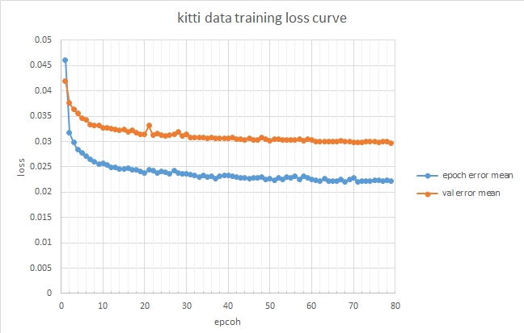
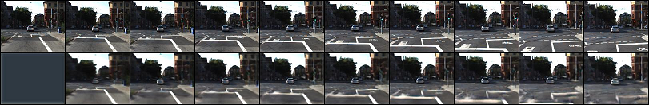
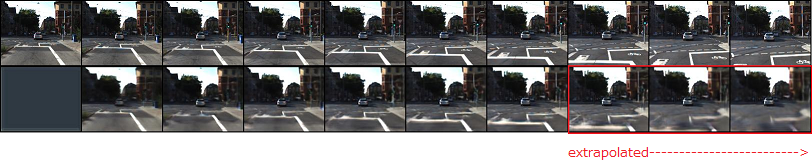

#  pytorch prednet practice   

This is a prednet practice using [leido/pytorch-prednet](https://github.com/leido/pytorch-prednet) modified code 
and preprocessed KITTI data.  

## Major change from leido/pytorch-prednet 

- image format, from integer 0-255 to float 0-1.0  
- train data, sequence_start_mode from unique to all  
- ConvLSTMCell, sigmoid to hard_sigmoid  
- test data, last one to sequence  
- to add log output   
- to add cpu for function check. Actual train needs GPU.  
- to add option load-last to resume train.  

## data train loss

A loss curve is shown. 
This result does not reach to 0.0178 (training) 0.0236(validation), which other reports value using original prednet code.  

  
  
  

prednet_colab_prectice1.ipynb is a sample notebook to run on google colaboratory with google drive.  

## data test result 

Upper side is actual and lower side is predicted.  

  

Lower side last 3 images are extrapolated.  
  

## License  

Regarding to [original prednet code](https://github.com/coxlab/prednet) license, please see License_prednet.txt.  
Regarding to [kitti dataset](http://www.cvlibs.net/datasets/kitti/) license, please refer to [Creative Commons Attribution-NonCommercial-ShareAlike 3.0 License](https://creativecommons.org/licenses/by-nc-sa/3.0/).  
Regarding to hickle.py, please see LICENSE_hickle.  
Regarding to hard_sigmoid , please see see LICENSE_torchMoji.  
There is no license description of leido/pytorch-prednet and Kaixhin/lstms.py.  
Some code has benn changed and follow following,   
  
  
THE SOFTWARE IS PROVIDED "AS IS", WITHOUT WARRANTY OF ANY KIND, EXPRESS OR  
IMPLIED, INCLUDING BUT NOT LIMITED TO THE WARRANTIES OF MERCHANTABILITY,  
FITNESS FOR A PARTICULAR PURPOSE AND NONINFRINGEMENT. IN NO EVENT SHALL THE  
AUTHORS OR COPYRIGHT HOLDERS BE LIABLE FOR ANY CLAIM, DAMAGES OR OTHER  
LIABILITY, WHETHER IN AN ACTION OF CONTRACT, TORT OR OTHERWISE, ARISING FROM,  
OUT OF OR IN CONNECTION WITH THE SOFTWARE OR THE USE OR OTHER DEALINGS IN THE  
SOFTWARE.  
